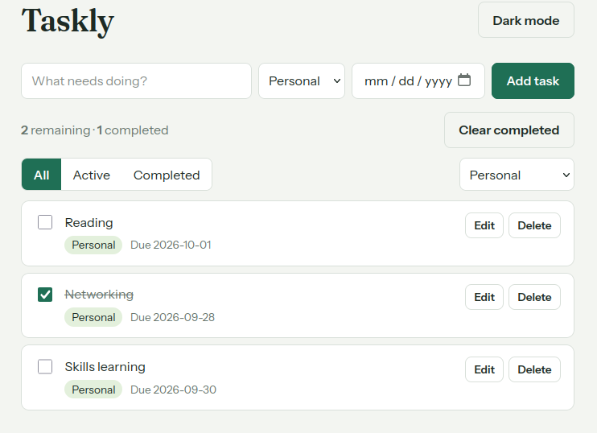
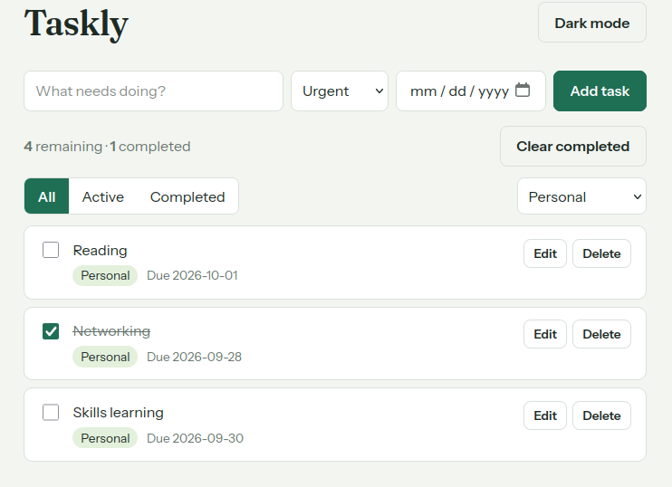
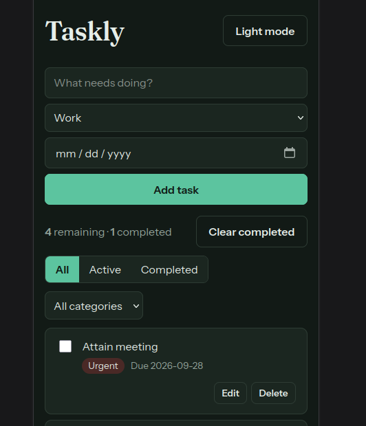

# Taskly – Personal Task Manager

Taskly is a single-page React app for managing daily to-dos. Tasks are organised by category, filtered by status, and saved in the browser so they survive a refresh.

**Live demo:** _add your Vercel/Netlify link here after deploying_

## Features

- Add, edit, delete and complete tasks
- Filter by status (All / Active / Completed) and by category (Work / Personal / Urgent)
- Live count of remaining and completed tasks, plus "Clear completed"
- Persistence with `localStorage` (tasks and theme)
- Due dates with a visual overdue indicator *(stretch goal)*
- Dark / light theme toggle *(stretch goal)*
- Responsive layout for desktop and mobile

## Technologies

React 18 (functional components and hooks), Vite 5, plain CSS with custom properties.

## Project structure

```
src/
  components/   Header, TaskForm, FilterBar, TaskStats, TaskList, TaskItem
  hooks/        useLocalStorage.js
  App.jsx       state + handlers
  index.css     styles and themes
```

## Setup

```bash
npm install
npm run dev
```

Open the URL Vite prints (usually http://localhost:5173). Build for production with `npm run build`.

## Screenshots





## Known limitations

- No drag-and-drop reordering
- Data is stored per browser, with no sync between devices
- Overdue check uses the browser's local date
